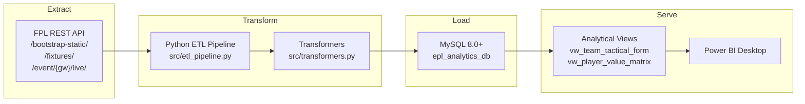
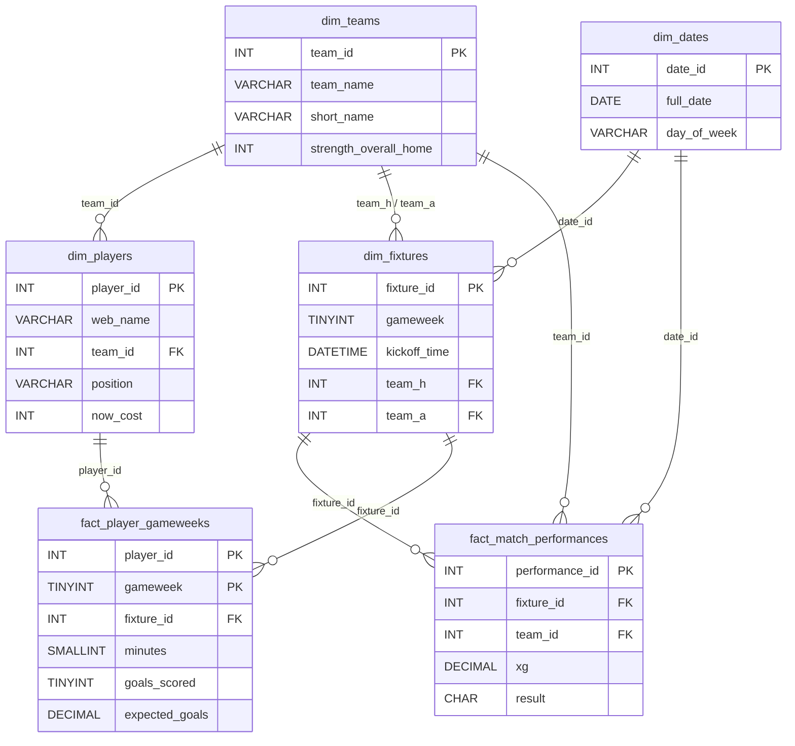

# EPL Analytics — Premier League Data Platform

A production-grade, end-to-end data platform that ingests Premier League data
from the [Fantasy Premier League (FPL) API](https://fantasy.premierleague.com/api/),
transforms it into a MySQL Star Schema data warehouse, and exposes analytical
views for Power BI dashboards.

---

## Architecture



### Star Schema



---

## Prerequisites

| Tool | Version | Purpose |
|------|---------|---------|
| **Python** | 3.10+ | ETL pipeline, tests, simulation |
| **MySQL Server** | 8.0+ | Data warehouse |
| **MySQL Workbench** | 8.0+ | DB management / inspection |
| **Power BI Desktop** | Latest | Reporting (optional) |
| **pip** | Latest | Python package management |

---

## Quick Start

### 1. Clone & Setup Environment

```bash
# Navigate to the project directory
cd "proj main"

# Create a virtual environment
python -m venv .venv

# Activate it
# Windows (PowerShell):
.venv\Scripts\Activate.ps1
# Windows (CMD):
.venv\Scripts\activate.bat
# macOS/Linux:
source .venv/bin/activate

# Install dependencies
pip install -r requirements.txt
```

### 2. Configure Environment Variables

```bash
# Copy the example .env file
copy .env.example .env    # Windows
cp .env.example .env      # macOS/Linux

# Edit .env with your MySQL credentials
```

`.env` contents:
```ini
DB_HOST=127.0.0.1
DB_PORT=3306
DB_USER=root
DB_PASSWORD=your_password_here
DB_NAME=epl_analytics_db
```

### 3. Create the Database Schema

Open **MySQL Workbench** and execute:

```sql
SOURCE sql/schema.sql;
SOURCE sql/views.sql;
```

Or from the command line:

```bash
mysql -u root -p < sql/schema.sql
mysql -u root -p < sql/views.sql
```

This creates:
- `epl_analytics_db` database
- 4 dimension tables (`dim_teams`, `dim_players`, `dim_fixtures`, `dim_dates`)
- 2 fact tables (`fact_player_gameweeks`, `fact_match_performances`)
- `dim_dates` pre-populated for the 2026/27 season
- 2 analytical views for Power BI

### 4. Run the ETL Pipeline

```bash
# Auto-detect current gameweek and ingest
python -m src.etl_pipeline

# Ingest a specific gameweek
python -m src.etl_pipeline --gameweek 3

# Full dimension refresh
python -m src.etl_pipeline --full-refresh

# Dry run (validate without writing to DB)
python -m src.etl_pipeline --dry-run
```

---

## CLI Reference

### ETL Pipeline

```
python -m src.etl_pipeline [OPTIONS]

Options:
  --gameweek N, -g N    Specific gameweek to ingest (1-38)
  --full-refresh        Force reload all dimension tables
  --dry-run             Validate pipeline without writing to DB
```

### Gameweek Simulator

```
python scripts/simulate_gameweeks.py
```

Generates synthetic match data for GW1–GW5 and loads it sequentially to verify:
- `ON DUPLICATE KEY UPDATE` upserts work correctly
- Rolling 5-match averages compute without errors
- Database constraints hold under sequential ingestion

### Synthetic Edge-Case Generator

```
python scripts/generate_synthetic_data.py [OPTIONS]

Options:
  --dry-run     Generate data and log SQL but don't execute
  --validate    Run validation queries only (data must be loaded)
```

Tests 6 edge-case scenarios:
1. **Missing xG** — NULL expected_goals / expected_assists
2. **Postponed fixtures** — NULL kickoff_time
3. **Mid-season transfers** — Player team_id changes between GWs
4. **Zero-minute appearances** — Bench players with 0 minutes
5. **Double gameweeks** — Player in 2 fixtures within same GW
6. **Extreme stats** — Max saves, red cards, high BPS values

---

## Running Tests

```bash
# Run all tests with verbose output
pytest tests/ -v

# Run with coverage report
pytest tests/ -v --tb=short

# Run a specific test class
pytest tests/test_ingestion.py::TestTransformTeams -v
```

### Test Coverage

| Test Class | What It Tests |
|---|---|
| `TestFPLClient` | API client with mocked HTTP, retries, error handling |
| `TestTransformTeams` | Team dimension transformer (shape, values, empty) |
| `TestTransformPlayers` | Player dimension (cost, position mapping, numerics) |
| `TestTransformFixtures` | Fixture dimension (gameweeks, postponed, FDR) |
| `TestTransformPlayerGameweek` | Fact transformer (stats, NULL xG, zero minutes) |
| `TestAggregateTeamMatchStats` | Team aggregation (2 rows per fixture, goal consistency) |
| `TestSafeDecimal` | Utility function edge cases |
| `TestCLIParsing` | CLI argument parsing |
| `TestUpsertIdempotency` | SQL generation, ON DUPLICATE KEY, empty DataFrames |

---

## Inspecting Data in MySQL Workbench

After running the pipeline or simulator, open MySQL Workbench and use these
queries to inspect your data:

```sql
-- Check loaded teams
SELECT * FROM dim_teams ORDER BY team_id;

-- Check player dimension
SELECT player_id, web_name, position, now_cost/10.0 AS cost_m, status
FROM dim_players
ORDER BY now_cost DESC
LIMIT 20;

-- Check fixtures for a gameweek
SELECT fixture_id, gameweek, team_h, team_a, team_h_score, team_a_score, finished
FROM dim_fixtures
WHERE gameweek = 1;

-- Check player stats for a gameweek
SELECT p.web_name, fpg.gameweek, fpg.minutes, fpg.goals_scored,
       fpg.assists, fpg.expected_goals, fpg.total_points
FROM fact_player_gameweeks fpg
JOIN dim_players p ON fpg.player_id = p.player_id
WHERE fpg.gameweek = 1
ORDER BY fpg.total_points DESC;

-- Check team tactical form view
SELECT team_name, gameweek, rolling_5m_avg_xg, rolling_5m_avg_goals,
       rolling_5m_xg_overperf
FROM vw_team_tactical_form
ORDER BY team_name, gameweek;

-- Check player value matrix view
SELECT web_name, position, team_short, cost_millions,
       xgi_per_90, cost_efficiency, upcoming_5_avg_fdr
FROM vw_player_value_matrix
WHERE total_minutes >= 90
ORDER BY cost_efficiency DESC
LIMIT 20;

-- Row counts across all tables
SELECT 'dim_teams' AS tbl, COUNT(*) AS rows FROM dim_teams
UNION ALL SELECT 'dim_players', COUNT(*) FROM dim_players
UNION ALL SELECT 'dim_fixtures', COUNT(*) FROM dim_fixtures
UNION ALL SELECT 'dim_dates', COUNT(*) FROM dim_dates
UNION ALL SELECT 'fact_player_gameweeks', COUNT(*) FROM fact_player_gameweeks
UNION ALL SELECT 'fact_match_performances', COUNT(*) FROM fact_match_performances;
```

---

## Power BI Integration

See the full guide at [`docs/POWERBI_GUIDE.md`](docs/POWERBI_GUIDE.md) for:

- MySQL ODBC driver installation
- Power BI Desktop connection setup
- Data model and relationship configuration
- DAX measures (rolling xG, xGI/90, fixture congestion, cost efficiency)
- Page 1 blueprint: Team Tactical & Form (scatter, line chart, bar chart)
- Page 2 blueprint: Player Recruitment & Value (quadrant scatter, FDR heatmap, target table)

---

## Project Structure

```
proj main/
├── .env                      # MySQL credentials (git-ignored)
├── .env.example              # Template for .env
├── requirements.txt          # Python dependencies
├── README.md                 # This file
│
├── src/                      # ETL Pipeline source code
│   ├── __init__.py
│   ├── config.py             # Database & API configuration
│   ├── api_client.py         # FPL REST API client with retries
│   ├── transformers.py       # JSON → DataFrame transformers
│   └── etl_pipeline.py       # Main ETL orchestrator + MySQLLoader
│
├── sql/                      # Database DDL and views
│   ├── schema.sql            # Star Schema creation + dim_dates population
│   └── views.sql             # Analytical views for Power BI
│
├── scripts/                  # Utility scripts
│   ├── simulate_gameweeks.py        # GW1-GW5 sequential simulation
│   └── generate_synthetic_data.py   # Edge-case data generator
│
├── tests/                    # Test suite
│   ├── __init__.py
│   ├── conftest.py           # Shared pytest fixtures
│   ├── test_ingestion.py     # Unit tests for all pipeline components
│   └── fixtures/             # Sample JSON payloads
│       ├── bootstrap_static.json
│       ├── fixtures.json
│       └── event_live.json
│
└── docs/                     # Documentation
    └── POWERBI_GUIDE.md      # Power BI setup & DAX guide
```

---

## Data Sources

All data is sourced from the official
[Fantasy Premier League API](https://fantasy.premierleague.com/api/):

| Endpoint | Data | Refresh Frequency |
|---|---|---|
| `/api/bootstrap-static/` | Teams, players, events, element types | Daily during season |
| `/api/fixtures/` | All scheduled fixtures with scores | After each matchday |
| `/api/event/{gw}/live/` | Live player stats per gameweek | During/after matches |

> **Note**: The FPL API is public and free, but rate-limited. The pipeline
> includes retry logic with exponential backoff.

---

## License

This project is for educational and personal analytics purposes.
Premier League data is © Premier League.
